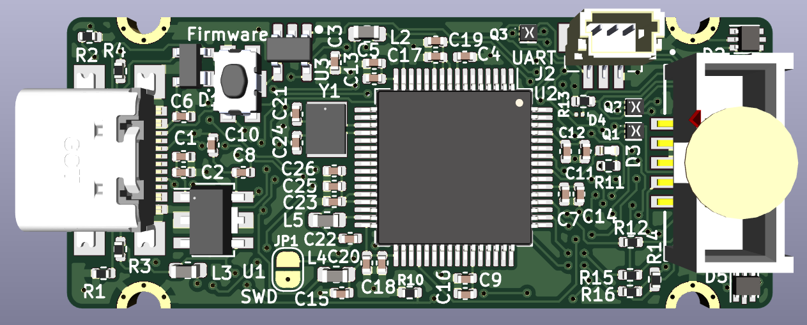
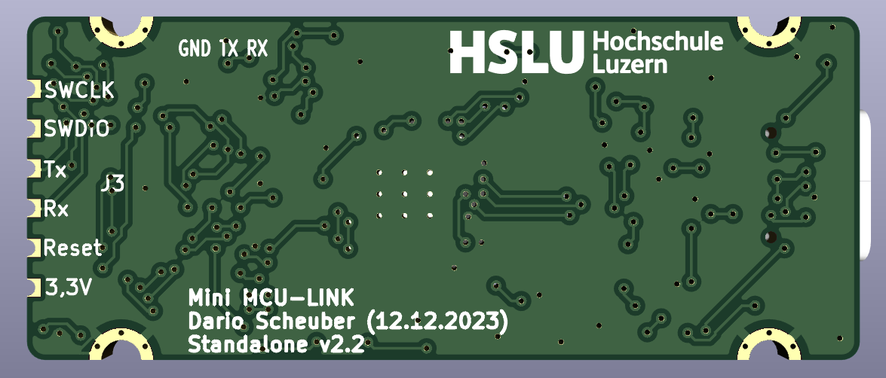

# McuLink-Mini
Version of the NXP MCU-Link CMSIS-DAP Debug Probe with KiCad.

This is the work of Dario Scheuber who created this debug probe in a student project (PAIND) at the Lucerne University of Applied Sciences and Arts, under guidance of Prof. Erich Styger.

Many thanks to Dario Scheuber and his work to make this project possible!

A blog article on https://mcuoneclipse.com/ should be published soon.

## Features
This is an open hardware version of the NXP MCU-Link CMSIS-DAP debug probe, with following features and differences to the original MCU-Link:
- Open hardware design with KiCad
- Firmware compatibility with MCU-Link (LinkServer, CMSIS-DAP, ARM DAPLink)
- Dual-Layer design for lower costs
- USB-C connector instead of  Micro-USB
- USB-C connector usable to debug the LPC55S69
- 30% smaller than the original MCU-Link
- Firmware/boot push button instead of jumper
- Micro connector for UART connection instead of pin header
- Supports only 3.3V targets (no level shifters)
- Standalone version as external debug probe
- On-Board version: Solder external debug probe on your custom board (castellated pins)
- Embedded version: copy-paste into your custom board KiCad design
- BOM/assembly costs ~$12 (100 units)

## Folders
- enclosure: 3D printed enclosure
- hardware: KiCad and hardware related files

## Links
- NXP MCU-Link: https://www.nxp.com/design/design-center/software/development-software/mcuxpresso-software-and-tools-/mcu-link-debug-probe:MCU-LINK
- KiCad: https://www.kicad.org/

